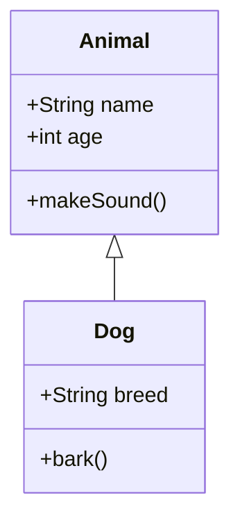
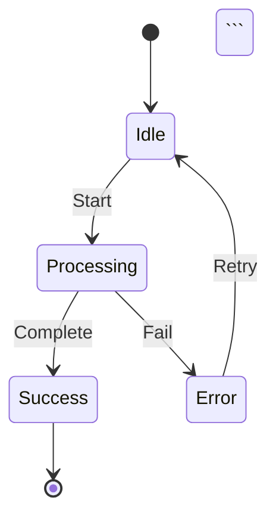
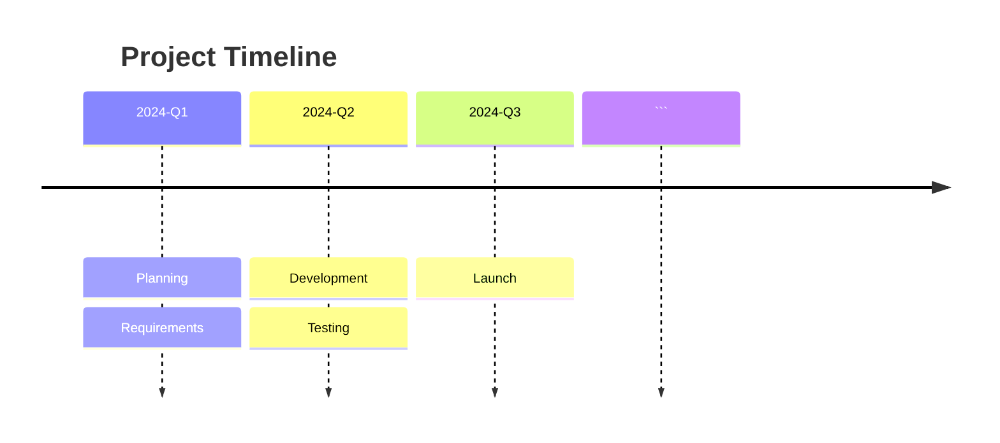
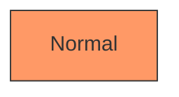
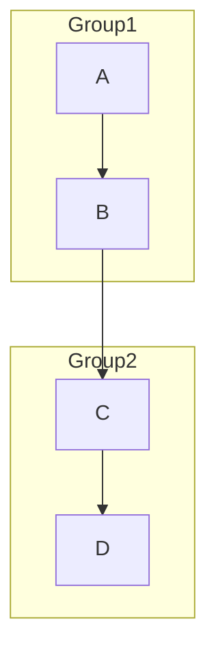
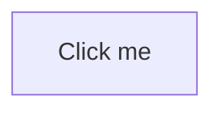

# Mermaid Diagrams Guide

Complete guide for using Mermaid diagrams in the Markdown to PDF Generator.

## Overview

Mermaid is a JavaScript-based diagramming and charting tool that renders Markdown-inspired text definitions to create and modify diagrams dynamically. This guide covers all supported diagram types and how to use them.

## Getting Started

### Using the Mermaid Viewer

1. Open `examples/viewer-mermaid.html` in your browser
2. Click "Open File" or drag and drop a Markdown file
3. Mermaid diagrams will be automatically rendered
4. Adjust settings in the Settings panel (⚙️)

### Basic Syntax

Wrap your Mermaid code in a code block with the `mermaid` language identifier:

```markdown
```mermaid
graph TD
    A[Start] --> B[End]
```​
```

## Supported Diagram Types

### 1. Flowcharts

Create flowcharts to visualize processes and workflows.

**Syntax:**
```markdown
```mermaid
flowchart TD
    A[Start] --> B{Decision}
    B -->|Yes| C[Process 1]
    B -->|No| D[Process 2]
    C --> E[End]
    D --> E
```​
```

**Node Shapes:**
- `[Rectangle]` - Rectangle
- `(Rounded)` - Rounded rectangle
- `([Stadium])` - Stadium shape
- `[[Subroutine]]` - Subroutine
- `[(Database)]` - Database
- `((Circle))` - Circle
- `{Diamond}` - Diamond
- `{{Hexagon}}` - Hexagon

**Arrow Types:**
- `-->` - Solid arrow
- `-.->` - Dotted arrow
- `==>` - Thick arrow
- `--text-->` - Arrow with text

### 2. Sequence Diagrams

Visualize interactions between different actors or systems.

**Syntax:**
```markdown
```mermaid
sequenceDiagram
    participant A as Alice
    participant B as Bob
    A->>B: Hello Bob!
    B->>A: Hi Alice!
    Note right of B: Bob thinks
    B-->>A: I'm good, thanks!
```​
```

**Arrow Types:**
- `->>` - Solid line with arrowhead
- `-->>` - Dotted line with arrowhead
- `-x` - Solid line with cross
- `--x` - Dotted line with cross

**Features:**
- `activate/deactivate` - Show activation boxes
- `Note` - Add notes
- `loop` - Create loops
- `alt/else` - Alternative paths
- `par` - Parallel execution

### 3. Entity Relationship Diagrams (ERD)

Model database schemas and relationships.

**Syntax:**
```markdown
```mermaid
erDiagram
    CUSTOMER ||--o{ ORDER : places
    CUSTOMER {
        string name
        string email
        int customerId PK
    }
    ORDER {
        int orderId PK
        date orderDate
        int customerId FK
    }
    ORDER ||--|{ LINE-ITEM : contains
    PRODUCT ||--o{ LINE-ITEM : "ordered in"
```​
```

**Relationship Types:**
- `||--||` - One to one
- `||--o{` - One to many
- `}o--o{` - Many to many
- `||--|{` - One to one or many

**Cardinality:**
- `|o` - Zero or one
- `||` - Exactly one
- `}o` - Zero or more
- `}|` - One or more

### 4. Class Diagrams

Represent object-oriented class structures.

**Syntax:**
```markdown


**Visibility:**
- `+` - Public
- `-` - Private
- `#` - Protected
- `~` - Package/Internal

**Relationships:**
- `<|--` - Inheritance
- `*--` - Composition
- `o--` - Aggregation
- `-->` - Association
- `..>` - Dependency
- `..|>` - Realization

### 5. State Diagrams

Show state transitions in a system.

**Syntax:**
```markdown


**Features:**
- `[*]` - Start/End state
- `state "Description" as StateId` - State with description
- `--` - Composite states
- `note` - Add notes

### 6. Gantt Charts

Create project timelines and schedules.

**Syntax:**
```markdown
```mermaid
gantt
    title Project Schedule
    dateFormat YYYY-MM-DD
    section Planning
    Requirements    :a1, 2024-01-01, 30d
    Design         :a2, after a1, 20d
    section Development
    Backend        :b1, after a2, 40d
    Frontend       :b2, after a2, 45d
```​
```

**Task Status:**
- `done` - Completed
- `active` - In progress
- `crit` - Critical path
- `milestone` - Milestone

### 7. Pie Charts

Display proportional data.

**Syntax:**
```markdown


### 8. Git Graphs

Visualize Git branching and merging.

**Syntax:**
```markdown


**Commands:**
- `commit` - Create commit
- `branch` - Create branch
- `checkout` - Switch branch
- `merge` - Merge branches

### 9. User Journey

Map user experiences and touchpoints.

**Syntax:**
```markdown
```mermaid
journey
    title User Shopping Journey
    section Browse
      Visit Site: 5: User
      Search: 4: User
    section Purchase
      Add to Cart: 3: User
      Checkout: 2: User
    section Post-Purchase
      Receive: 5: User
```​
```

**Score:** 1-5 (1=worst, 5=best)

### 10. Mindmaps

Create hierarchical mind maps.

**Syntax:**
```markdown
```mermaid
mindmap
  root((Central Idea))
    Topic 1
      Subtopic 1.1
      Subtopic 1.2
    Topic 2
      Subtopic 2.1
```​
```

### 11. Timeline

Display chronological events.

**Syntax:**
```markdown


### 12. Quadrant Chart

Plot items in a 2x2 matrix.

**Syntax:**
```markdown
```mermaid
quadrantChart
    title Priority Matrix
    x-axis Low Impact --> High Impact
    y-axis Low Effort --> High Effort
    quadrant-1 Quick Wins
    quadrant-2 Major Projects
    quadrant-3 Fill-ins
    quadrant-4 Thankless Tasks
    Item A: [0.3, 0.6]
    Item B: [0.7, 0.8]
```​
```

## Themes

Choose from multiple themes in the Settings panel:

### Default Theme
Clean, professional look with blue accents.

### Dark Theme
Dark background with light text, great for presentations.

### Forest Theme
Green color scheme, nature-inspired.

### Neutral Theme
Grayscale, minimal color usage.

### Base Theme
Simple, basic styling.

## Best Practices

### 1. Keep It Simple
- Avoid overly complex diagrams
- Break large diagrams into smaller ones
- Use clear, descriptive labels

### 2. Use Consistent Naming
- Follow naming conventions
- Use meaningful identifiers
- Keep labels concise

### 3. Add Context
- Include titles where appropriate
- Add notes for clarification
- Use descriptive text on arrows

### 4. Test Before Exporting
- Preview diagrams in the viewer
- Check for rendering errors
- Verify all elements are visible

### 5. Optimize for PDF
- Consider page size when designing
- Avoid extremely wide diagrams
- Test print preview before exporting

## Common Issues

### Diagram Not Rendering

**Problem:** Mermaid code block not rendering

**Solutions:**
1. Check syntax is correct
2. Ensure "Mermaid Diagrams" is enabled in settings
3. Verify code block uses ```mermaid
4. Check browser console for errors

### Syntax Errors

**Problem:** Error message displayed instead of diagram

**Solutions:**
1. Validate syntax against Mermaid documentation
2. Check for missing semicolons or brackets
3. Ensure proper indentation
4. Test in Mermaid Live Editor first

### Diagram Too Large

**Problem:** Diagram extends beyond page boundaries

**Solutions:**
1. Simplify the diagram
2. Split into multiple diagrams
3. Adjust page size in settings
4. Use landscape orientation

### Text Overlapping

**Problem:** Labels or text overlapping in diagram

**Solutions:**
1. Shorten label text
2. Adjust diagram layout
3. Try different theme
4. Increase spacing between nodes

## Advanced Features

### Custom Styling

Add custom CSS classes to nodes:



### Subgraphs

Group related nodes:



### Links and Tooltips

Add clickable links:



## Integration with Markdown

### Combining with Other Elements

Mermaid diagrams work seamlessly with other Markdown elements:

```markdown
# Project Architecture

Here's our system architecture:

```mermaid
flowchart TD
    Client --> API
    API --> Database
```​

## Key Components

- **Client**: Web browser
- **API**: REST API server
- **Database**: PostgreSQL
```

### Multiple Diagrams

Include multiple diagrams in one document:

```markdown
# System Design

## Data Flow

```mermaid
flowchart LR
    Input --> Process --> Output
```​

## Database Schema

```mermaid
erDiagram
    USER ||--o{ POST : creates
```​
```

## Export to PDF

### Steps

1. Open your Markdown file with Mermaid diagrams
2. Verify all diagrams render correctly
3. Adjust settings if needed
4. Click "Export PDF"
5. Use browser's print dialog to save

### Tips

- Use "Print Background Graphics" option
- Select appropriate page size
- Check print preview first
- Consider landscape for wide diagrams

## Resources

### Official Documentation
- [Mermaid Documentation](https://mermaid.js.org/)
- [Mermaid Live Editor](https://mermaid.live/)

### Examples
- See `examples/sample-mermaid.md` for comprehensive examples
- Try different diagram types
- Experiment with themes

### Support
- Check browser console for errors
- Validate syntax in Mermaid Live Editor
- Review this guide for best practices

## Troubleshooting

### Browser Compatibility

**Supported Browsers:**
- Chrome/Edge 90+
- Firefox 88+
- Safari 14+

**Not Supported:**
- Internet Explorer
- Very old browser versions

### Performance

**For Large Documents:**
- Limit number of diagrams per page
- Use simpler diagram types
- Consider splitting into multiple files

### Security

**Content Security Policy:**
- Mermaid uses inline styles
- May require CSP adjustments
- Test in your environment

## Conclusion

Mermaid diagrams provide a powerful way to visualize complex information in your Markdown documents. With support for 12+ diagram types and multiple themes, you can create professional documentation with ease.

Start with simple diagrams and gradually explore more complex features as you become comfortable with the syntax.

---

**Version:** 1.0.0
**Last Updated:** 2024
**Mermaid Version:** 10.x
