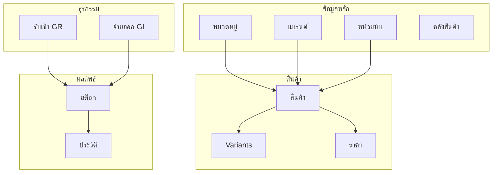
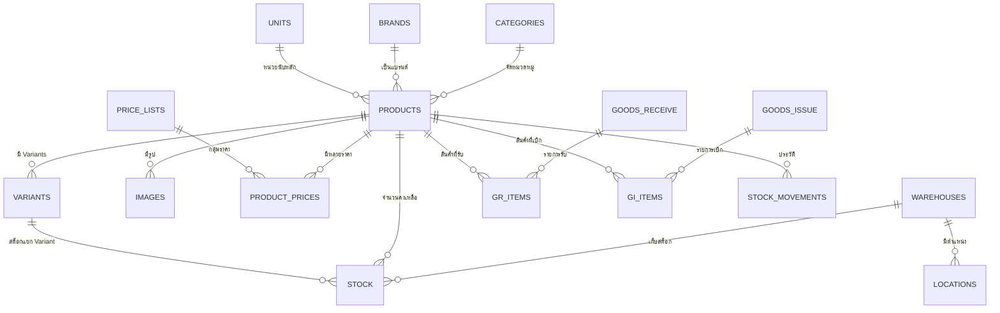

# 📦 ระบบ Inventory - คู่มือการใช้งาน

## 📋 สารบัญ

1. [ภาพรวมระบบ](#ภาพรวมระบบ)
2. [องค์ประกอบหลัก](#องค์ประกอบหลัก)
3. [กระบวนการทำงาน](#กระบวนการทำงาน)
4. [ความสัมพันธ์ระหว่างข้อมูล](#ความสัมพันธ์ระหว่างข้อมูล)
5. [ตัวอย่างการใช้งานจริง](#ตัวอย่างการใช้งานจริง)

---

## ภาพรวมระบบ

ระบบ **Inventory** เป็นระบบบริหารจัดการสินค้าคงคลังแบบครบวงจร ออกแบบมาเพื่อรองรับ:

- **ร้านค้าปลีก/ค้าส่ง** - จัดการสินค้า ราคา และสต็อก
- **POS (Point of Sale)** - ขายหน้าร้าน
- **E-Commerce** - ขายออนไลน์
- **การจัดการหลายคลังสินค้า** - คลังกลาง คลังสาขา คลังเสียหาย

### สิ่งที่ระบบทำได้

| ความสามารถ | คำอธิบาย |
|------------|----------|
| 🏷️ **จัดการสินค้า** | เพิ่ม แก้ไข ลบสินค้า พร้อมหมวดหมู่ แบรนด์ และรูปภาพ |
| 🎨 **สินค้าตัวเลือก (Variants)** | สินค้าที่มีหลายตัวเลือก เช่น สี ไซส์ |
| 💰 **หลายราคา (Price Lists)** | ตั้งราคาต่างกันสำหรับลูกค้าแต่ละกลุ่ม (ปลีก/ส่ง/VIP) |
| 🏭 **หลายคลังสินค้า** | จัดการสต็อกแยกตามคลัง แยกตามตำแหน่งจัดเก็บ |
| 📥 **รับสินค้าเข้า (GR)** | บันทึกการรับสินค้าจากซัพพลายเออร์ |
| 📤 **เบิก/จ่ายสินค้า (GI)** | บันทึกการขาย จ่ายสินค้าไปให้ลูกค้า |
| 📊 **ติดตามสต็อก** | ดู Lot Number, Serial Number, วันหมดอายุ |

---

## องค์ประกอบหลัก

ระบบแบ่งออกเป็น **3 กลุ่มหลัก**:

### 1. 🏷️ ข้อมูลหลักสินค้า (Product Master Data)

ข้อมูลพื้นฐานที่ต้องตั้งค่าก่อนเริ่มใช้งาน:

#### 1.1 📂 หมวดหมู่สินค้า (Categories)
จัดกลุ่มสินค้าเป็นลำดับชั้น เช่น:
```
อุปกรณ์สำนักงาน
├── เครื่องเขียน
├── กระดาษ
└── หมึกพิมพ์
อุปกรณ์ IT
├── คอมพิวเตอร์
├── อุปกรณ์ต่อพ่วง
└── อุปกรณ์เครือข่าย
```

**ประโยชน์:**
- จัดหมวดหมู่สินค้าให้ค้นหาง่าย
- ใช้กรองสินค้าในรายงาน
- แสดงเมนูหมวดหมู่บนหน้าเว็บ E-Commerce

#### 1.2 🏢 แบรนด์ (Brands)
ยี่ห้อสินค้า เช่น HP, Dell, Canon, Logitech

**ประโยชน์:**
- ลูกค้าค้นหาสินค้าตามยี่ห้อ
- วิเคราะห์ยอดขายตามแบรนด์

#### 1.3 📏 หน่วยนับ (Units)
หน่วยนับสินค้า เช่น ชิ้น, กล่อง, ลัง, กิโลกรัม

| หน่วย | สัญลักษณ์ | คำอธิบาย |
|-------|-----------|----------|
| ชิ้น | PCS | หน่วยนับทั่วไป |
| กล่อง | BOX | บรรจุกล่อง |
| ลัง | CTN | ลัง/Carton |
| กิโลกรัม | KG | น้ำหนัก |

**การแปลงหน่วย:**
ระบบรองรับการแปลงหน่วย เช่น:
- 1 กล่อง = 12 ชิ้น
- 1 ลัง = 24 ชิ้น

ทำให้สามารถสั่งซื้อเป็น "ลัง" แต่ขายเป็น "ชิ้น" ได้

#### 1.4 📦 สินค้า (Products)
ข้อมูลหลักของสินค้าแต่ละรายการ ประกอบด้วย:

**ข้อมูลพื้นฐาน:**
- `SKU` - รหัสสินค้า (ไม่ซ้ำกัน)
- `Barcode` - รหัสบาร์โค้ด
- `ชื่อสินค้า` - ชื่อที่แสดงให้ลูกค้า
- `คำอธิบาย` - รายละเอียดสินค้า

**การจัดหมวดหมู่:**
- เลือกหมวดหมู่
- เลือกแบรนด์
- เลือกหน่วยนับหลัก

**ราคา:**
- `ราคาทุน (Cost Price)` - ราคาซื้อมา
- `ราคาขาย (Sale Price)` - ราคาขายปกติ
- `ราคาเปรียบเทียบ (Compare Price)` - ราคาขีดฆ่า

**การควบคุมสต็อก:**
- `สต็อกขั้นต่ำ (Min Stock)` - แจ้งเตือนเมื่อสต็อกต่ำ
- `จุดสั่งซื้อใหม่ (Reorder Point)` - จุดที่ควรสั่งซื้อเพิ่ม
- `ปริมาณสั่งซื้อ (Reorder Qty)` - จำนวนที่ควรสั่งแต่ละครั้ง

**ตัวเลือกพิเศษ:**
- `มี Serial Number` - สินค้าที่ติดตามทีละชิ้น (เครื่องใช้ไฟฟ้า)
- `มี Lot/Batch` - สินค้าที่ผลิตเป็นล็อต (อาหาร, ยา)
- `อายุสินค้า (วัน)` - สำหรับสินค้ามีวันหมดอายุ

#### 1.5 🎨 สินค้าตัวเลือก (Variants)
สินค้าที่มีหลายตัวเลือก เช่น เสื้อมีหลายสี หลายไซส์

**ตัวอย่าง:**
```
สินค้าหลัก: เสื้อยืดคอกลม
├── Variant 1: เสื้อยืดคอกลม - แดง - S
├── Variant 2: เสื้อยืดคอกลม - แดง - M
├── Variant 3: เสื้อยืดคอกลม - น้ำเงิน - S
└── Variant 4: เสื้อยืดคอกลม - น้ำเงิน - M
```

แต่ละ Variant มี:
- SKU แยก
- Barcode แยก
- ราคาแยก (ถ้าต่างกัน)
- สต็อกแยก

#### 1.6 🖼️ รูปภาพสินค้า (Product Images)
อัพโหลดรูปได้หลายรูปต่อสินค้า:
- รูปหลัก (Primary)
- รูปเพิ่มเติม
- รูปสำหรับแต่ละ Variant

---

### 2. 🏭 การจัดการคลังสินค้า (Warehouse Management)

#### 2.1 🏠 คลังสินค้า (Warehouses)
กำหนดคลังสินค้าต่างๆ ในองค์กร:

| คลัง | ประเภท | คำอธิบาย |
|------|--------|----------|
| คลังสินค้าหลัก | คลังกลาง | เก็บสต็อกหลัก |
| คลังสาขา 1 | หน้าร้าน (POS) | สต็อกสำหรับขายหน้าร้าน |
| คลังสินค้าเสียหาย | คลังพิเศษ | เก็บสินค้าชำรุด |

**แต่ละคลังมีข้อมูล:**
- รหัสคลัง (`WH-MAIN`, `WH-BRANCH1`)
- ชื่อคลัง
- ที่อยู่
- ผู้จัดการคลัง
- คลังนี้เป็นหน้าร้าน (POS) หรือไม่
- อนุญาตให้สต็อกติดลบได้หรือไม่

#### 2.2 📍 ตำแหน่งจัดเก็บ (Warehouse Locations)
แบ่งพื้นที่ภายในคลังเป็นตำแหน่งย่อย:

```
คลังสินค้าหลัก
├── Zone A
│   ├── ชั้น 01
│   │   ├── A-01-01 (กระดาษ)
│   │   └── A-01-02 (หมึกพิมพ์)
│   └── ชั้น 02
│       └── A-02-01
└── Zone B
    └── ชั้น 01
        └── B-01-01 (อุปกรณ์ IT)
```

**ประโยชน์:**
- ค้นหาสินค้าได้รวดเร็ว
- จัดหยิบสินค้า (Picking) ได้ง่าย
- วางแผนพื้นที่จัดเก็บ

#### 2.3 📊 สต็อก (Stock)
ยอดสินค้าคงเหลือในแต่ละคลัง/ตำแหน่ง

**ข้อมูลในสต็อก:**
- สินค้า + Variant
- คลังสินค้า + ตำแหน่ง
- Lot Number (ถ้ามี)
- Serial Number (ถ้ามี)
- วันหมดอายุ (ถ้ามี)
- จำนวนคงเหลือ
- จำนวนที่ถูกจอง (Reserved)
- ต้นทุนต่อหน่วย
- สถานะ (พร้อมขาย, จอง, เสียหาย, หมดอายุ)

---

### 3. 📝 การทำธุรกรรมสินค้า (Transactions)

#### 3.1 📥 รับสินค้าเข้าคลัง (Goods Receive - GR)
บันทึกการรับสินค้าจากซัพพลายเออร์

**ขั้นตอนการทำงาน:**


**ข้อมูลในใบรับสินค้า:**
- เลขที่ใบรับ (`GR-2026-0001`)
- ซัพพลายเออร์
- คลังสินค้าที่รับเข้า
- วันที่รับ
- หมายเหตุ

**รายการสินค้าที่รับ:**
- สินค้า + Variant
- ตำแหน่งจัดเก็บ
- Lot Number / Serial Number (ถ้ามี)
- วันหมดอายุ (ถ้ามี)
- จำนวนที่รับ
- ราคาทุนต่อหน่วย

#### 3.2 📤 เบิก/จ่ายสินค้า (Goods Issue - GI)
บันทึกการส่งสินค้าออกจากคลัง

**ประเภทการจ่าย:**
| ประเภท | คำอธิบาย |
|--------|----------|
| `sale` | ขายให้ลูกค้า |
| `internal` | ใช้ภายใน |
| `transfer` | โอนคลัง |
| `return` | คืนซัพพลายเออร์ |
| `sample` | แจกตัวอย่าง |
| `damage` | ตัดเสียหาย |

**ขั้นตอนการทำงาน:**


#### 3.3 📋 ประวัติความเคลื่อนไหว (Stock Movements)
บันทึกทุกการเปลี่ยนแปลงสต็อกโดยอัตโนมัติ

**ประเภทความเคลื่อนไหว:**
| ประเภท | สัญลักษณ์ | คำอธิบาย |
|--------|-----------|----------|
| `receive` | ➕ | รับเข้าคลัง |
| `issue` | ➖ | จ่ายออก |
| `transfer` | 🔄 | โอนคลัง |
| `adjust` | ⚙️ | ปรับปรุงสต็อก |
| `count` | 📝 | ปรับจากการตรวจนับ |
| `return` | ↩️ | รับคืน |

**ข้อมูลที่บันทึก:**
- เลขที่เอกสาร
- ประเภท
- อ้างอิงจากเอกสารใด (GR, GI)
- สินค้า + คลัง + ตำแหน่ง
- จำนวน (+ หรือ -)
- ผู้ทำรายการ
- วันเวลา

---

### 4. 💰 การจัดการราคา (Pricing)

#### 4.1 📋 กลุ่มราคา (Price Lists)
กำหนดราคาต่างกันสำหรับลูกค้าแต่ละกลุ่ม:

| กลุ่มราคา | รหัส | กลุ่มลูกค้า |
|-----------|------|------------|
| ราคาปลีก | RETAIL | ลูกค้าทั่วไป |
| ราคาส่ง | WHOLESALE | ลูกค้าซื้อยกโหล |
| ราคา VIP | VIP | ลูกค้าพิเศษ |

#### 4.2 💵 ราคาขั้นบันได (Tiered Pricing)
ราคาลดลงเมื่อซื้อมากขึ้น:

**ตัวอย่าง: กระดาษ A4**
| กลุ่มราคา | ซื้อขั้นต่ำ | ราคา/รีม |
|-----------|-------------|----------|
| ราคาปลีก | 1 | 120 บาท |
| ราคาส่ง | 10 | 110 บาท |
| ราคาส่ง | 50 | 100 บาท |
| ราคาส่ง | 100 | 95 บาท |
| ราคา VIP | 1 | 105 บาท |

---

## กระบวนการทำงาน

### 🔄 วงจรการทำงานหลัก



### 📥 กระบวนการรับสินค้า (Goods Receive Flow)

1. **สั่งซื้อจาก VMS** (ถ้าใช้ร่วมกับโมดูล VMS)
   - สร้าง Vendor Order
   - รอซัพพลายเออร์จัดส่ง

2. **รับสินค้า**
   - สร้างใบ Goods Receive
   - อ้างอิง Vendor Order (ถ้ามี)
   - เลือกคลังสินค้าที่รับ
   - เพิ่มรายการสินค้า พร้อมจำนวน

3. **ตรวจสอบและอนุมัติ**
   - ตรวจสอบจำนวนตรงกับที่สั่ง
   - บันทึก Lot / Serial / วันหมดอายุ
   - ผู้มีอำนาจอนุมัติ

4. **ผลลัพธ์**
   - สต็อกเพิ่มอัตโนมัติ
   - บันทึก Stock Movement

### 📤 กระบวนการจ่ายสินค้า (Goods Issue Flow)

1. **รับคำสั่งซื้อ**
   - จาก CRM (Deals)
   - จาก POS
   - จาก E-Commerce

2. **สร้างใบเบิก**
   - สร้างใบ Goods Issue
   - เลือกประเภท (ขาย, โอนคลัง, ฯลฯ)
   - เพิ่มรายการสินค้า

3. **จัดหยิบสินค้า (Picking)**
   - ดูว่าสินค้าอยู่ตำแหน่งไหน
   - เลือก Lot ที่จะจ่าย (FIFO / FEFO)

4. **อนุมัติและจัดส่ง**
   - ผู้มีอำนาจอนุมัติ
   - บันทึกการจัดส่ง

5. **ผลลัพธ์**
   - สต็อกลดอัตโนมัติ
   - บันทึก Stock Movement

---

## ความสัมพันธ์ระหว่างข้อมูล

### 🔗 แผนภาพความสัมพันธ์



### 📊 สรุปความสัมพันธ์

| จาก | ไป | ความสัมพันธ์ |
|-----|------|--------------|
| หมวดหมู่ | สินค้า | 1 หมวดหมู่มีหลายสินค้า |
| แบรนด์ | สินค้า | 1 แบรนด์มีหลายสินค้า |
| สินค้า | Variants | 1 สินค้ามีหลายตัวเลือก |
| สินค้า | รูปภาพ | 1 สินค้ามีหลายรูป |
| กลุ่มราคา | ราคาสินค้า | 1 กลุ่มมีหลายราคา |
| คลังสินค้า | ตำแหน่ง | 1 คลังมีหลายตำแหน่ง |
| คลังสินค้า | สต็อก | 1 คลังเก็บหลายสต็อก |
| GR/GI | รายการ | 1 ใบมีหลายรายการ |

---

## ตัวอย่างการใช้งานจริง

### 📌 ตัวอย่าง 1: ร้านขายเครื่องเขียน

**ตั้งค่าเริ่มต้น:**
1. สร้างหมวดหมู่: เครื่องเขียน, กระดาษ, อุปกรณ์สำนักงาน
2. สร้างแบรนด์: Pilot, Double A, 3M
3. สร้างหน่วย: ชิ้น, กล่อง, รีม
4. สร้างคลัง: คลังหลัก, หน้าร้าน

**เพิ่มสินค้า:**
```
SKU: PP-A480
ชื่อ: กระดาษ A4 80 แกรม
หมวดหมู่: กระดาษ
แบรนด์: Double A
หน่วยนับ: รีม
ราคาทุน: 95 บาท
ราคาขาย: 120 บาท
สต็อกขั้นต่ำ: 50 รีม
จุดสั่งซื้อใหม่: 100 รีม
```

**รับสินค้า:**
- สร้าง GR-2026-0001
- รับจากซัพพลายเออร์ XYZ Paper
- เข้าคลังหลัก
- กระดาษ A4 จำนวน 200 รีม @ 95 บาท
- อนุมัติ → สต็อกเพิ่มเป็น 200 รีม

**ขายสินค้า:**
- สร้าง GI-2026-0001
- ลูกค้า: บริษัท ABC จำกัด
- เบิกจากคลังหลัก
- กระดาษ A4 จำนวน 50 รีม @ 100 บาท (ราคาส่ง)
- อนุมัติ → สต็อกลดเหลือ 150 รีม

### 📌 ตัวอย่าง 2: ร้านขายเสื้อผ้า (มี Variants)

**เพิ่มสินค้า:**
```
SKU: SHIRT-POLO-001
ชื่อ: เสื้อโปโล Premium
ประเภท: มี Variants ✓
```

**เพิ่ม Variants:**
| SKU | ตัวเลือก | ราคา |
|-----|----------|------|
| SHIRT-POLO-001-WS | ขาว - S | 450 บาท |
| SHIRT-POLO-001-WM | ขาว - M | 450 บาท |
| SHIRT-POLO-001-WL | ขาว - L | 490 บาท |
| SHIRT-POLO-001-BS | ดำ - S | 450 บาท |
| SHIRT-POLO-001-BM | ดำ - M | 450 บาท |
| SHIRT-POLO-001-BL | ดำ - L | 490 บาท |

**สต็อก:**
แต่ละ Variant มีสต็อกแยก:
- ขาว-S: 20 ตัว
- ขาว-M: 30 ตัว
- ขาว-L: 15 ตัว
- ดำ-S: 25 ตัว
- ดำ-M: 40 ตัว
- ดำ-L: 10 ตัว

### 📌 ตัวอย่าง 3: บริษัทค้าส่ง (หลายคลัง + หลายราคา)

**คลังสินค้า:**
- คลังกลางกรุงเทพ (WH-BKK)
- คลังภาคเหนือ (WH-NORTH)
- คลังภาคใต้ (WH-SOUTH)

**กลุ่มราคา:**
- ราคาปลีก (ลูกค้าทั่วไป)
- ราคาตัวแทน L1 (ส่วนลด 10%)
- ราคาตัวแทน L2 (ส่วนลด 20%)

**การทำงาน:**
1. รับสินค้าเข้าคลังกลาง
2. โอนย้ายไปคลังสาขา (Transfer GI)
3. สาขาเบิกขายลูกค้าตามกลุ่มราคา

---

## 🔧 สถานะระบบปัจจุบัน

### ✅ ใช้งานได้
- จัดการหมวดหมู่ แบรนด์ หน่วยนับ
- จัดการสินค้าพื้นฐาน
- จัดการคลังสินค้า
- จัดการกลุ่มราคา
- สร้าง Goods Receive / Goods Issue
- ดูประวัติ Stock Movements

### ⚠️ ต้องปรับปรุง
- ระบบ Variants ยังไม่สมบูรณ์
- การคำนวณสต็อกอัตโนมัติ
- การเชื่อมต่อกับ VMS Orders
- การเชื่อมต่อกับ CRM Deals
- รายงานสต็อก

### 📋 แผนการพัฒนา
1. ทำให้ Goods Receive สามารถอัพเดทสต็อกอัตโนมัติ
2. ทำให้ Goods Issue สามารถหักสต็อกอัตโนมัติ
3. เชื่อมต่อกับ VMS สำหรับการสั่งซื้อ
4. เชื่อมต่อกับ CRM สำหรับการขาย
5. พัฒนารายงานและ Dashboard

---

> 📝 **หมายเหตุ**: เอกสารนี้อธิบายตามการใช้งานจริง ไม่ได้อิงจากโค้ด เพื่อให้เข้าใจภาพรวมของระบบก่อนเริ่มพัฒนาต่อ
