# Mermaid Diagram Examples

This document demonstrates various types of Mermaid diagrams supported by the viewer.

## 1. Flowchart

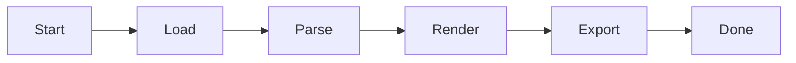

## 2. Sequence Diagram

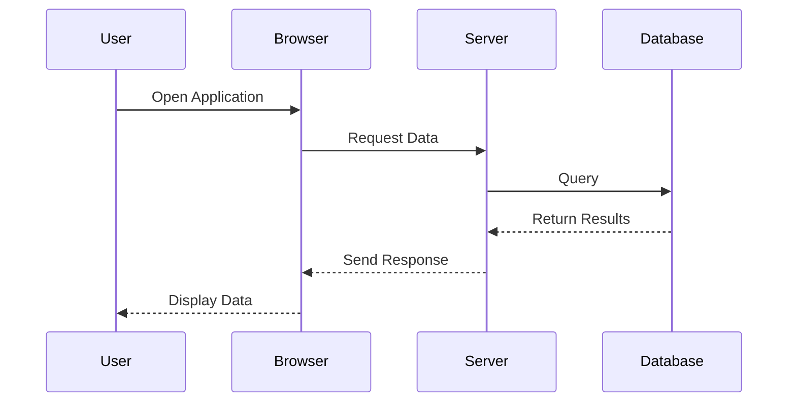

## 3. Entity Relationship Diagram (ERD)

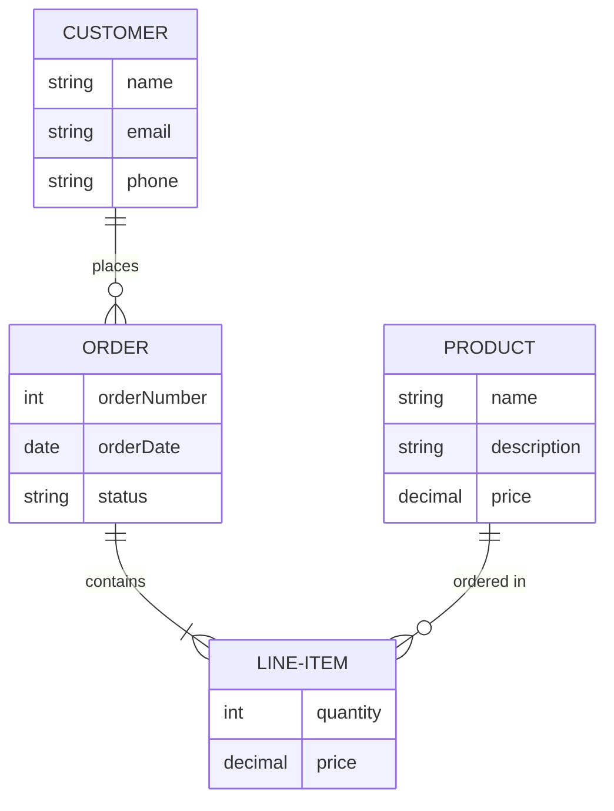

## 4. Class Diagram

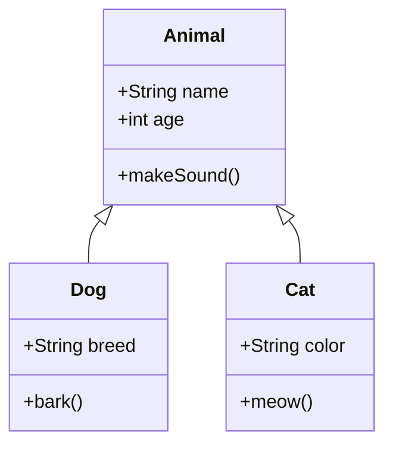

## 5. State Diagram

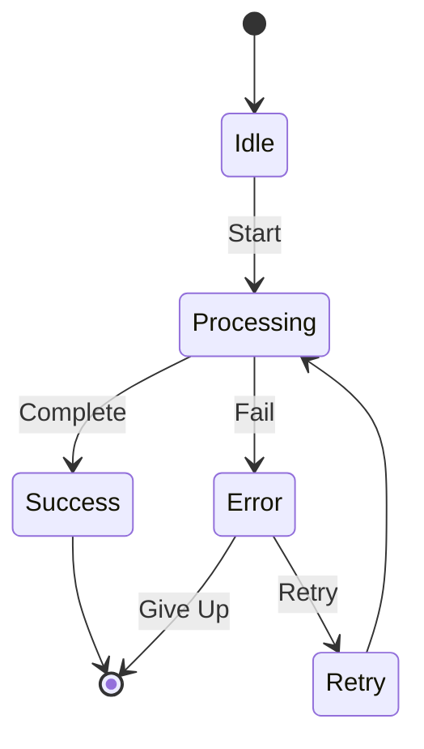

## 6. Gantt Chart

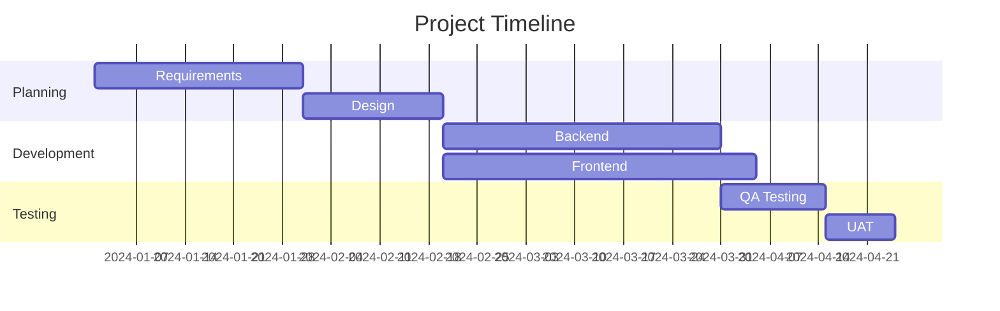

## 7. Pie Chart

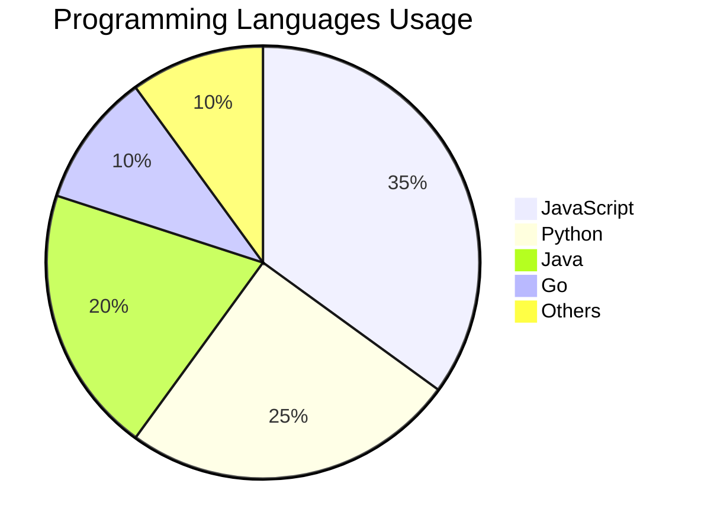

## 8. Git Graph

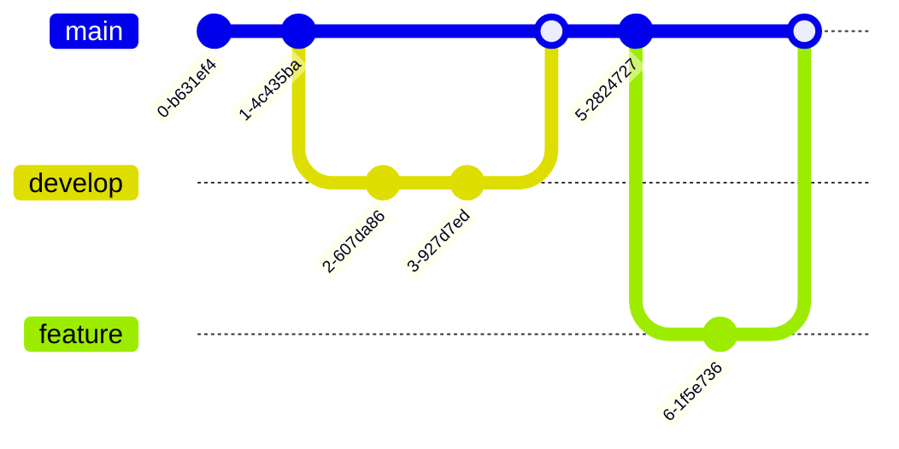

## 9. User Journey

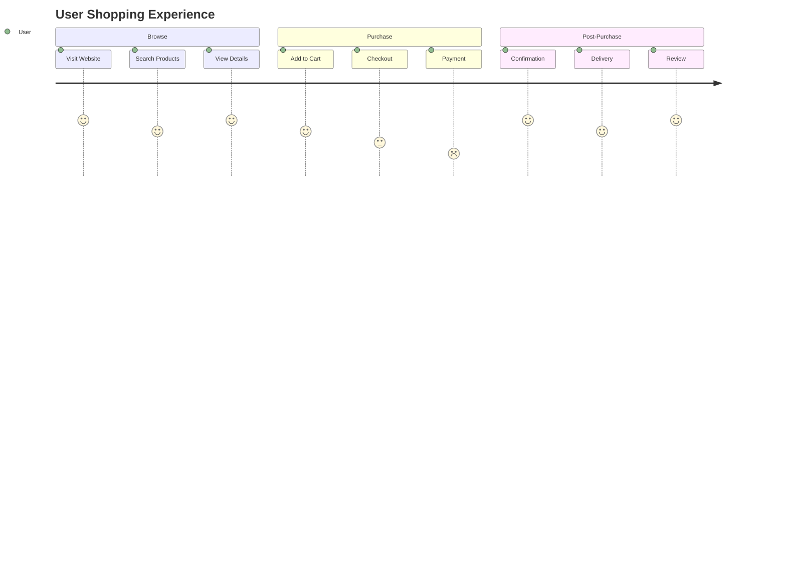

## 10. Mindmap

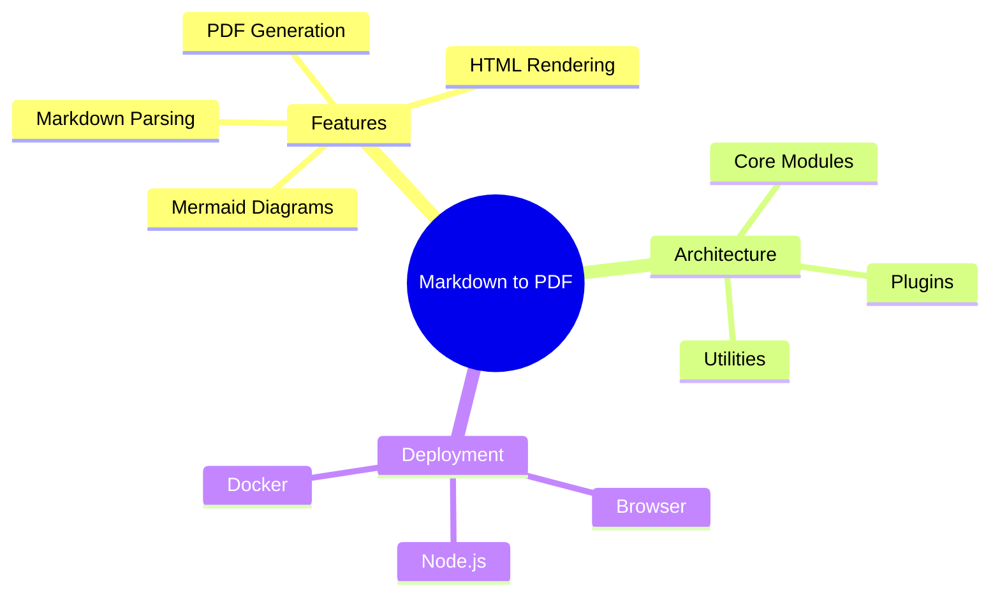

## 11. Timeline

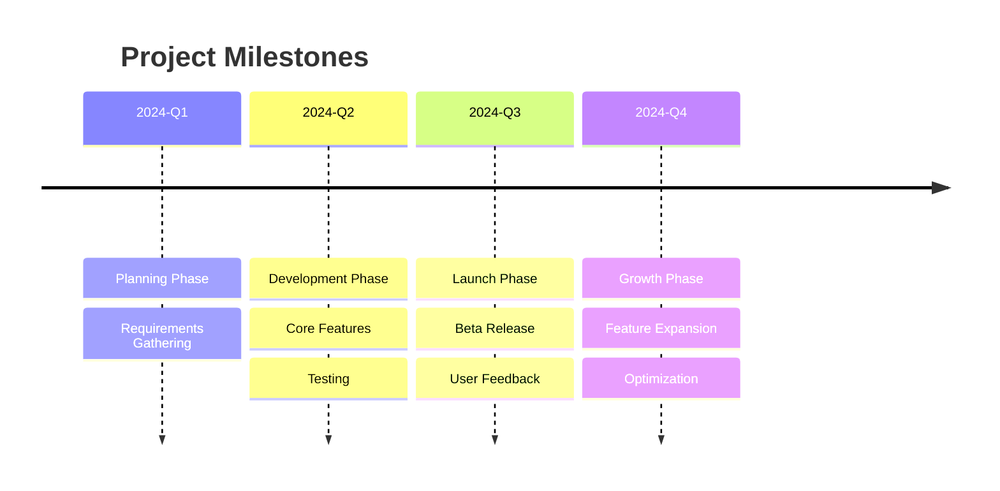

## 12. Quadrant Chart

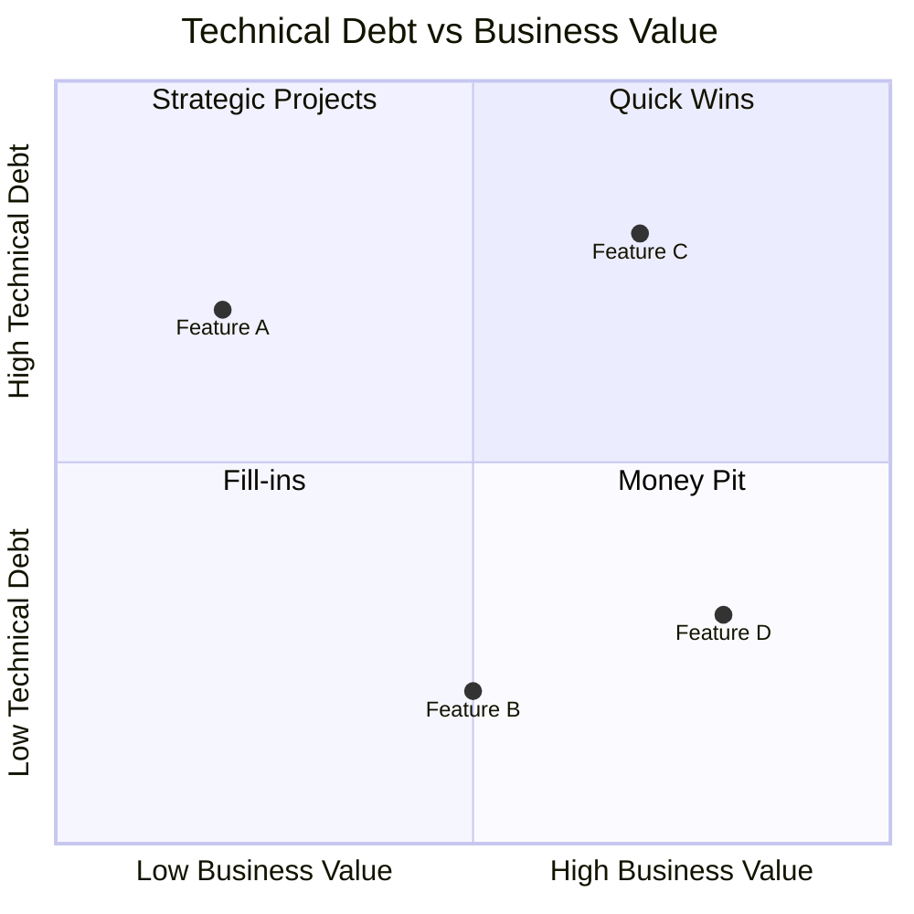

## Conclusion

This document demonstrates the wide variety of Mermaid diagrams that can be rendered in the Markdown viewer. All diagrams are rendered client-side using the Mermaid library.

### Supported Diagram Types

- ✅ Flowcharts
- ✅ Sequence Diagrams
- ✅ Entity Relationship Diagrams (ERD)
- ✅ Class Diagrams
- ✅ State Diagrams
- ✅ Gantt Charts
- ✅ Pie Charts
- ✅ Git Graphs
- ✅ User Journey
- ✅ Mindmaps
- ✅ Timelines
- ✅ Quadrant Charts

### Tips for Best Results

1. **Keep diagrams simple** - Complex diagrams may be hard to read
2. **Use descriptive labels** - Make your diagrams self-explanatory
3. **Choose appropriate themes** - Try different Mermaid themes in settings
4. **Test before exporting** - Preview diagrams before generating PDF

---

*Generated with Markdown to PDF Viewer with Mermaid Support*
